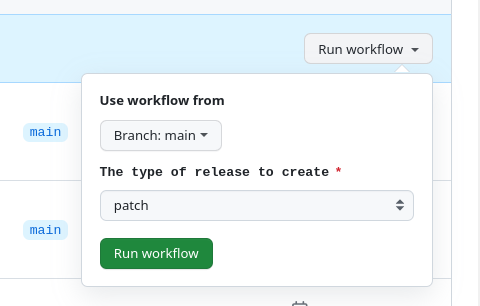

# Platformatic Meraki

## Name meaning
[TODO]

## Project Setup

### Install

```bash
$ npm install
```

### Fix dependencies

The native dependencies are build / downloaded for electron. 
If you need to launch the test (run in `node`), you need to fix the dependencies.

```bash
$ npm run fix-node-deps
```
You can rollback the fix with `npm run fix-electron-deps`.


### Development

### UI Components Live

This is necessary only if you want to change ui-components and see the changes live in meraki. Once that you have download the ui-components:

```
$ git clone git@github.com:platformatic/ui-components
$ cd ui-components
$ npm install
$ npm run tailwind:watch
$ cd ../meraki
$ npm link ../ui-components
$ rm -rf node_modules/.vite
```
And Relaunch the server

### Commands

* `npm run dev` to start the dev server

```bash
$ npm run dev
```

### Application Build

```bash
# For Windows
$ npm run build:win

# For macOS
$ npm run build:mac

# For Linux
$ npm run build:linux
```

### Release

Launch the `release` or `release-version-dump` action manually.
In the `release-version-dump` case you need to select the release type (`patch`, `minor`, `major`). The version dump is done before the release. 



When done, you can generate/adjust the release notes in the release page.


